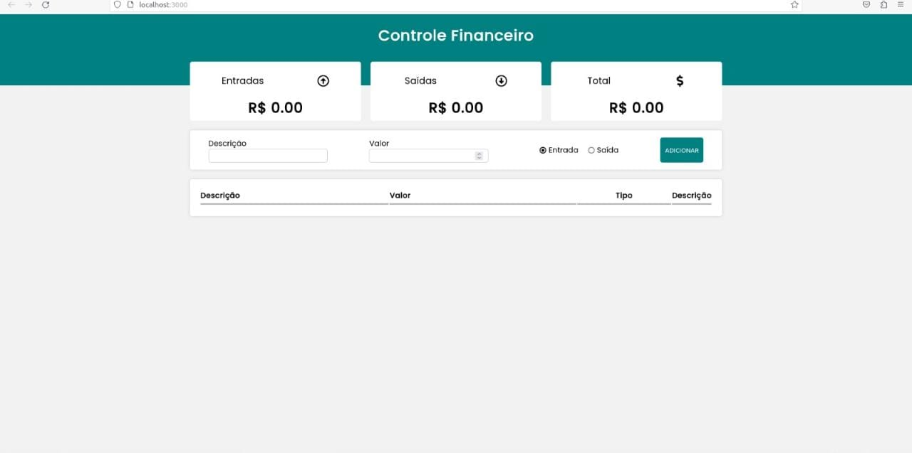
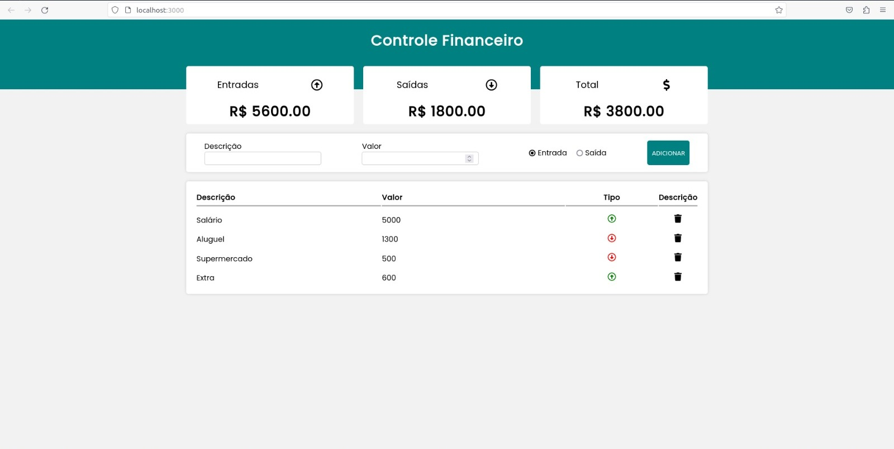

# Controle Financeiro

## Sobre

Este é um Sistema de Finanças desenvolvido em ReactJS que permite gerenciar entradas de dinheiro e gastos. O sistema calcula o total de dinheiro que entrou e os gastos realizados, exibindo o saldo disponível.

---

## Funcionalidades

- Registro de entradas de dinheiro e gastos
- Cálculo automático do total de entradas e saídas
- Exibição do saldo atual
- Exibição de todas as entradas e saídas em uma tabela
- Opção de exclusão de itens da tabela
- Armazenamento dos dados no localStorage do navegador

---
## Tecnologias utilizadas

O sistema foi desenvolvido utilizando as seguintes tecnologias:

- ReactJS: Biblioteca JavaScript de código aberto para criação de interfaces de usuário.
- JavaScript: Linguagem de programação usada para desenvolver a lógica do sistema.
- Styled-Components: Biblioteca para estilização de componentes React com CSS em JavaScript.
- NPM: Gerenciador de pacotes do Node.js utilizado para instalar e gerenciar as dependências do projeto.

---
## Algumas imagens do sistema

<h1>
    
</h1>
<br>

<h1>
    
</h1>

---
## Como baixar o projeto

```bash

    # Clonar o repositório 
    $ git clone https://github.com/FranciFerr/Controle-Financeiro

    # Entrar no diretório
    $ cd Controle-Financeiro

    # Instalar as dependências
    $ npm install

    # Iniciar o projeto
    $ npm start

```